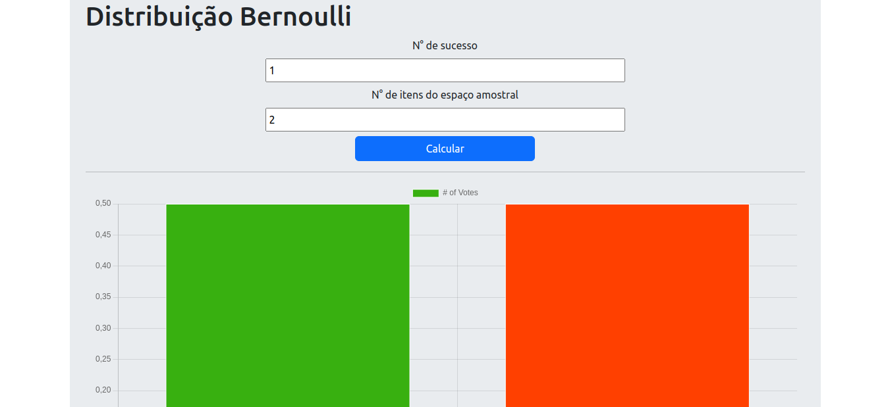

# Distribuição Bernoulli

> Site que calcula a probabilidade de sucesso ou fracasso, mostrando graficamente o resultado.

## 🤝 Colaboradores

<table>
  <tr>
    <td align="center">
      <a href="#">
         
        
          <b>José Henrique</b>
        
      </a>
    </td>
  </tr>
</table>

